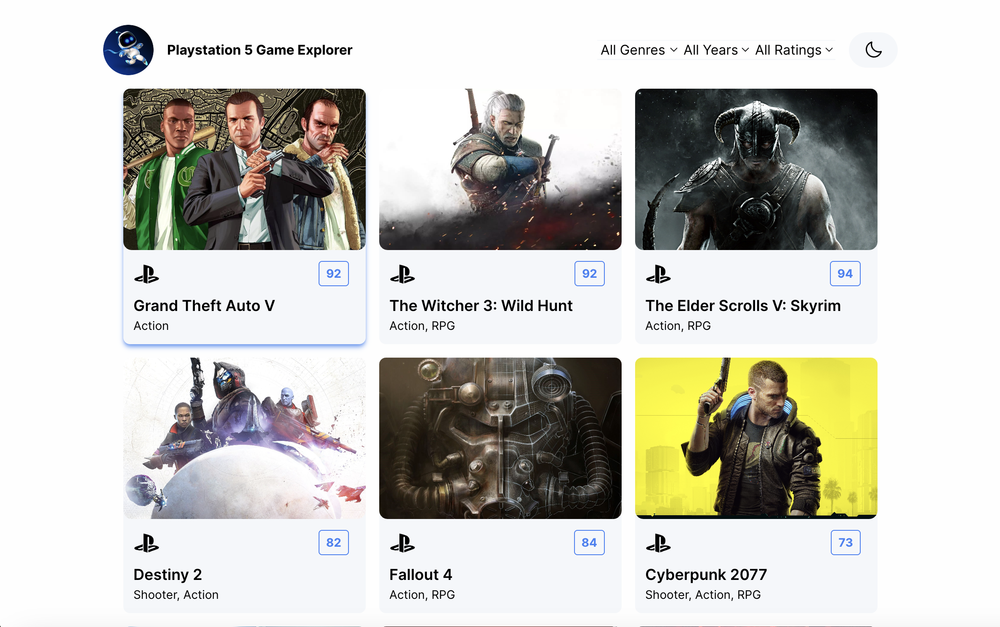
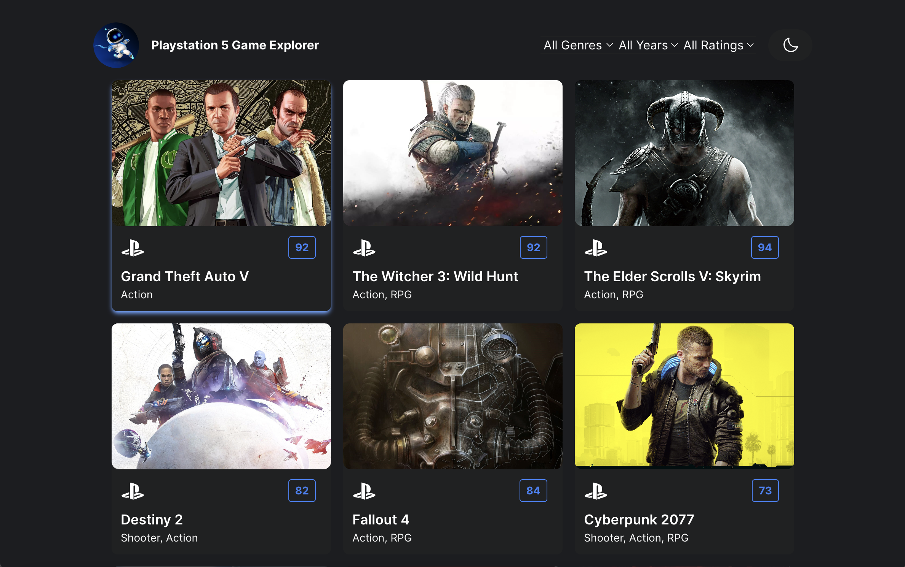
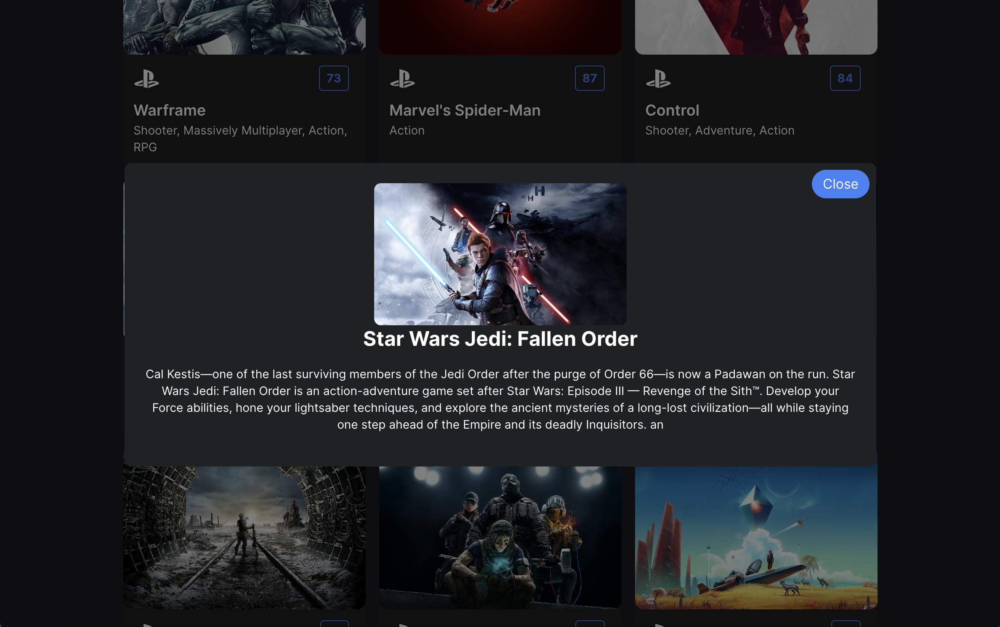

# 🎮 PlayStation 5 Game Explorer

A responsive web application that allows users to browse, filter, and explore popular PlayStation 5 games using the RAWG Video Games Database API. The app features light/dark theme toggling, interactive cards, and a detailed popup for game descriptions.

# Project Outline

The goal of this project was to create a visually appealing, responsive single-page app that fetches real-time game data, allows users to apply filters (genre, release year, rating), and view detailed game descriptions—all with a sleek dark/light theme toggle.

# Features

- 🎮 Browse and explore PlayStation 5 games
- 🔍 Filter by genre, release year, and rating
- 🌙 Toggle between light and dark mode
- 📱 Responsive design with mobile-friendly hamburger filter
- 🖼 Click on a game to open a popup with a full description and image
- ⚡ Fast-loading and accessible UI with hover effects and custom styling

# Screenshots

_Home Page - Light Mode_

_Home Page - Dark Mode_

_Pop Up Window_

# Installation Instructions

- Clone and import the files within this GitHub project into your development environment
- Install dependencies
- Create a .env file and add your RAWG API key
- Start the server

# Tech Stack

- React (with Hooks)
- Tailwind CSS
- RAWG Video Games API
- Vite
- JavaScript (ES6+)
- Iconify

# Testing Strategy

- Manual testing across desktop and mobile screen sizes
- Ensured interactivity and layout responsiveness at various breakpoints
- Verified API calls, error handling, and conditional rendering
- Theme toggling tested with context and visual inspection
